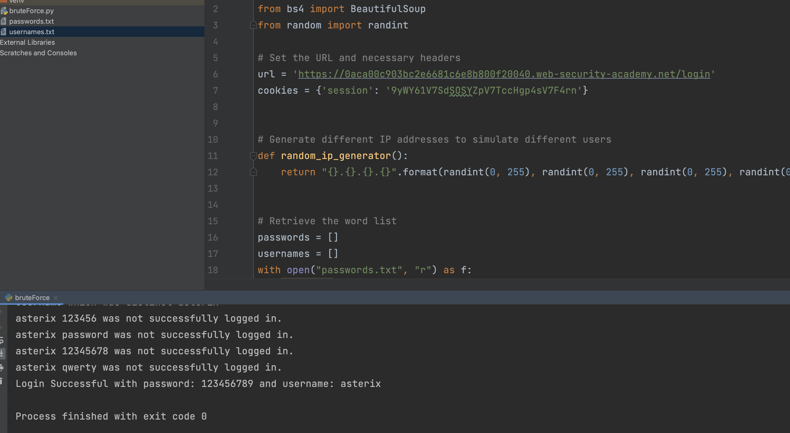
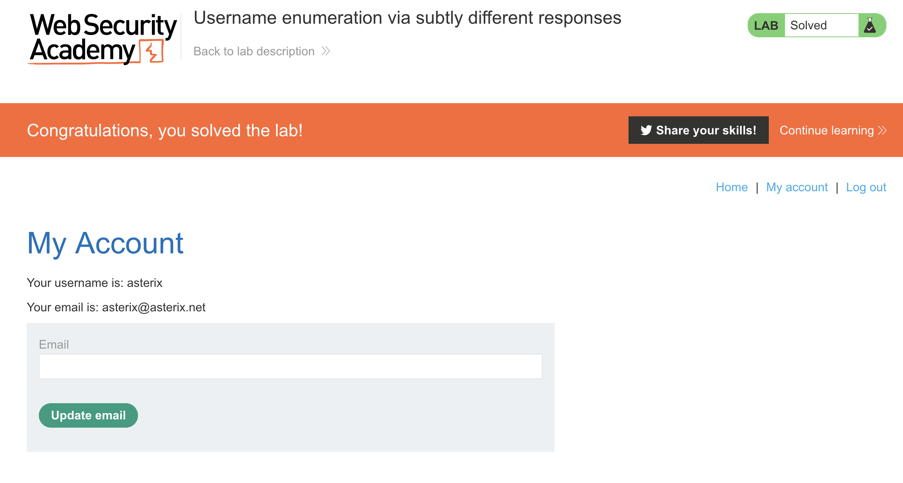

# username-enumeration-via-subtly-different-responses

This repository is solution to assignment on Data Security Course. It is a portswigger [Lab](https://portswigger.net/web-security/authentication/password-based/lab-username-enumeration-via-subtly-different-responses) which was assigned to me to solve.

# Description

I have provided comments on code and it is much more clear that I prefer not to over explain them. But here some tips I wanna explain:

1. Used beautifulsoap4 to extract error message.
2. Found error messages dynamically.
3. Used random ip generator.

# Result

You can observe that the script found the user name and the password

Now we can sign in.
